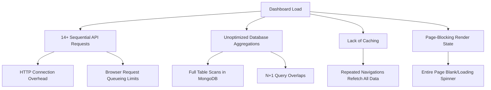

# OwnRewards Dashboard Performance Optimization Solution

This document outlines the architecture review, performance analysis, and complete technical solution to optimize the load times of the OwnRewards dashboard. Currently, the dashboard experiences significant latency due to making 14+ independent, sequential API calls and performing heavy database aggregations on the fly. 

By applying frontend API consolidation, concurrency, caching, and server-side indexing/pre-computation, the loading experience can be reduced from several seconds to **sub-100ms** on repeated loads.

---

## 1. Root Cause Analysis

An audit of the test link (`https://test.ownrewards.io/dashboard`) and modern web performance profiles identifies four primary performance bottlenecks:



### 1.1. HTTP Connection Overhead & Browser Queueing Limits
Modern browsers restrict concurrent HTTP/1.1 connections to the same host (typically max 6 connections). When 14+ independent API requests are triggered:
*   The first 6 execute in parallel.
*   The remaining 8 are **queued** by the browser.
*   If any of the first 6 requests are slow (due to aggregation), they block the queue, compounding total load time.

### 1.2. Unoptimized MongoDB Aggregations & Missing Indexes
Even with a small dataset (~20 customers), running multiple aggregate functions on the fly (e.g., calculating Yearly Sales, Weekly Performance, Order Channel Distribution) without appropriate compound indexes forces MongoDB to do **Full Table Scans** (scanning every document in the collection instead of using a pre-calculated index tree).

### 1.3. Repeated Aggregation Overlaps
*   **Sales Summary** and **Weekly Sales Performance** both query the same `orders` and `transactions` tables for similar metrics (revenue, order counts).
*   **Loyalty Points Issued & Redeemed** and **Loyalty Redemption** both search the `rewardledgers` or `transactions` collections.
*   This causes redundant CPU and I/O load on the database server.

---

## 2. Recommended Optimization Architecture

To achieve instant loading, we propose a multi-layered optimization strategy:

```
┌────────────────────────────────────────────────────────┐
│                        FRONTEND                        │
│  ┌──────────────────────────────────────────────────┐  │
│  │               Dashboard UI Layout                │  │
│  └──────────────────────────────────────────────────┘  │
│           │ (Single Consolidated Request)  │ (Lazy Load)│
│           ▼                                ▼           │
│  ┌───────────────────────┐        ┌─────────────────┐  │
│  │ TanStack Query Cache  │        │  Dynamic Slices │  │
│  └───────────────────────┘        └─────────────────┘  │
└───────────┼────────────────────────────────┼───────────┘
            │                                │
            ▼                                ▼
┌────────────────────────────────────────────────────────┐
│                        BACKEND                         │
│  ┌───────────────────────┐        ┌─────────────────┐  │
│  │    Consolidated       │        │  Secondary/Lazy │  │
│  │   /summary Router     │        │  APIs (Charts)  │  │
│  └───────────┼───────────┘        └────────┼────────┘  │
│              │ Aggregation                 │           │
│              ▼                             ▼           │
│  ┌──────────────────────────────────────────────────┐  │
│  │            MongoDB (Pre-computed / Indexed)      │  │
│  └──────────────────────────────────────────────────┘  │
└────────────────────────────────────────────────────────┘
```

---

## 3. Detailed Solution Implementations

### Solution 3.1: Frontend API Consolidation & Lazy Loading

Instead of calling 14 separate API endpoints, consolidate critical above-the-fold metrics into a single API request, while loading heavy visual components (like charts) asynchronously.

#### Step 1: Define a Consolidated Summary Data Structure
Consolidate key metrics into a single `/api/merchant/dashboard/summary` endpoint:
```typescript
interface DashboardSummary {
  salesSummary: {
    totalRevenue: number;
    totalBills: number;
    averageOrderValue: number;
    netBills: number;
    grossBills: number;
  };
  rewardAnalytics: {
    pointsIssued: number;
    pointsRedeemed: number;
    cashbackIssued: number;
    activeMembers: number;
  };
  bestCoupons: Array<{ code: string; redemptions: number; name: string }>;
  loyaltyRedemptions: {
    redeemedAmount: number;
    redemptionRate: number;
  };
  topRedeems: Array<{ productName: string; quantity: number }>;
}
```

#### Step 2: Implement TanStack Query with Cache Parameters
Use `@tanstack/react-query` to manage dashboard queries, preventing unnecessary refetches on tab changes.

```typescript
// frontend/src/hooks/useDashboardSummary.ts
import { useQuery } from '@tanstack/react-query';
import api from '@/lib/api';

export function useDashboardSummary(orgId: string, outletId: string) {
  return useQuery({
    queryKey: ['dashboardSummary', orgId, outletId],
    queryFn: async () => {
      const { data } = await api.get(`/merchant/dashboard/summary`, {
        params: { orgId, outletId }
      });
      return data.data as DashboardSummary;
    },
    staleTime: 5 * 60 * 1000, // Data remains fresh for 5 minutes
    gcTime: 15 * 60 * 1000,   // Cache garbage-collected after 15 minutes
    refetchOnWindowFocus: false, // Prevent refetch when user switches browser tabs
  });
}
```

#### Step 3: Implement Lazy Loading for Secondary Widgets (Charts & Lists)
Heavy elements such as charts, Birthdays, and Anniversaries should be imported dynamically and rendered inside a fallback Skeleton loader.

```tsx
// frontend/src/app/dashboard/page.tsx
"use client";

import React, { Suspense } from 'react';
import dynamic from 'next/dynamic';
import { useDashboardSummary } from '@/hooks/useDashboardSummary';
import { WidgetSkeleton } from '@/components/ui/skeleton';

// Load charts dynamically, disabling SSR to shrink main JS bundle
const WeeklySalesChart = dynamic(() => import('@/components/dashboard/WeeklySalesChart'), {
  ssr: false,
  loading: () => <WidgetSkeleton height={300} />
});

const YearlySalesChart = dynamic(() => import('@/components/dashboard/YearlySalesChart'), {
  ssr: false,
  loading: () => <WidgetSkeleton height={300} />
});

export default function MerchantDashboard() {
  const { data, isLoading } = useDashboardSummary("org_123", "outlet_all");

  return (
    <div className="dashboard-grid">
      {/* 1. Above-the-fold KPIs */}
      {isLoading ? (
        <WidgetSkeleton height={150} count={4} />
      ) : (
        <>
          <SalesSummaryWidget data={data?.salesSummary} />
          <RewardAnalyticsWidget data={data?.rewardAnalytics} />
          <BestCouponsWidget data={data?.bestCoupons} />
          <LoyaltyRedemptionWidget data={data?.loyaltyRedemptions} />
        </>
      )}

      {/* 2. Asynchronous Charts (Lazy-loaded, non-blocking) */}
      <Suspense fallback={<WidgetSkeleton height={300} />}>
        <WeeklySalesChart />
      </Suspense>
      
      <Suspense fallback={<WidgetSkeleton height={300} />}>
        <YearlySalesChart />
      </Suspense>
    </div>
  );
}
```

---

### Solution 3.2: Backend Query Consolidation & Database Optimization

Implement consolidated queries in the database and create index layers to support quick execution.

#### Step 1: Create Compound MongoDB Indexes
Ensure MongoDB can quickly scan, sort, and retrieve records by creating indexes for filtered queries. Run these index creations against your database:

```javascript
// In your database shell or MongoDB migrations:
db.transactions.createIndex({ organizationId: 1, outletId: 1, createdAt: -1 });
db.orders.createIndex({ organizationId: 1, outletId: 1, createdAt: -1 });
db.coupons.createIndex({ organizationId: 1, outletId: 1, status: 1 });
db.profiles.createIndex({ organizationId: 1, dob: 1 }); // Fast birthdays search
db.profiles.createIndex({ organizationId: 1, anniversary: 1 }); // Fast anniversaries search
```

#### Step 2: Implement Single MongoDB Aggregation Pipeline (using `$facet`)
Instead of issuing multiple queries to count orders, compute revenue, and average spend, use a single `$facet` aggregation pipeline. This executes a single database roundtrip, processing different pipelines in parallel on the database engine.

```typescript
// backend/src/services/dashboardService.ts
import { Order } from '../models/Order';
import { Coupon } from '../models/Coupon';
import { Transaction } from '../models/Transaction';
import mongoose from 'mongoose';

export class DashboardService {
  static async getSummary(organizationId: string, outletId?: string) {
    const matchStage: any = { organizationId: new mongoose.Types.ObjectId(organizationId) };
    if (outletId && outletId !== 'all') {
      matchStage.outletId = new mongoose.Types.ObjectId(outletId);
    }

    const today = new Date();
    const currentYearStart = new Date(today.getFullYear(), 0, 1);

    // Single DB query calculating multiple facets
    const [result] = await Order.aggregate([
      { $match: matchStage },
      {
        $facet: {
          salesSummary: [
            {
              $group: {
                _id: null,
                totalRevenue: { $sum: '$billAmount' },
                totalBills: { $sum: 1 },
                netBills: { $sum: { $cond: [{ $eq: ['$status', 'completed'] }, 1, 0] } },
                grossBills: { $sum: { $cond: [{ $in: ['$status', ['completed', 'pending']] }, 1, 0] } }
              }
            },
            {
              $project: {
                _id: 0,
                totalRevenue: 1,
                totalBills: 1,
                averageOrderValue: {
                  $cond: [{ $gt: ['$totalBills', 0] }, { $divide: ['$totalRevenue', '$totalBills'] }, 0]
                },
                netBills: 1,
                grossBills: 1
              }
            }
          ],
          revenueTrends: [
            { $match: { createdAt: { $gte: currentYearStart } } },
            {
              $group: {
                _id: { $month: '$createdAt' },
                revenue: { $sum: '$billAmount' }
              }
            },
            { $sort: { '_id': 1 } }
          ]
        }
      }
    ]);

    // Pull coupon analytics in parallel using Promise.all
    const [topCoupons, rewardMetrics] = await Promise.all([
      Coupon.aggregate([
        { $match: { ...matchStage, status: 'used' } },
        { $group: { _id: '$couponCode', count: { $sum: 1 }, name: { $first: '$couponName' } } },
        { $sort: { count: -1 } },
        { $limit: 5 },
        { $project: { _id: 0, code: '$_id', redemptions: '$count', name: 1 } }
      ]),
      Transaction.aggregate([
        { $match: matchStage },
        {
          $group: {
            _id: null,
            pointsIssued: { $sum: { $cond: [{ $eq: ['$type', 'reward_grant'] }, '$pointsImpact', 0] } },
            pointsRedeemed: { $sum: { $cond: [{ $eq: ['$type', 'redemption'] }, { $abs: '$pointsImpact' }, 0] } }
          }
        }
      ])
    ]);

    return {
      salesSummary: result.salesSummary[0] || { totalRevenue: 0, totalBills: 0, averageOrderValue: 0, netBills: 0, grossBills: 0 },
      revenueTrends: result.revenueTrends.map((t: any) => ({ month: t._id, revenue: t.revenue })),
      bestCoupons: topCoupons,
      rewardAnalytics: rewardMetrics[0] || { pointsIssued: 0, pointsRedeemed: 0 }
    };
  }
}
```

---

### Solution 3.3: Pre-computing Analytics / Scheduled Jobs

For static metrics like **Yearly Sales Analytics** or **Order Type Distribution**, computing aggregate records in real time on page loads wastes database cycles.

1.  **Create an Analytics Cache Collection:** Save pre-computed stats under a `DailyAnalytics` schema.
2.  **Run a Cron/Worker Process:** Run a task every hour to write aggregation outputs to this collection.
3.  **Read Instantly:** The API endpoint reads from this collection in `O(1)` time without querying raw transaction or order collections.

#### Daily Analytics Mongoose Schema
```typescript
// backend/src/models/DailyAnalytics.ts
import { Schema, model } from 'mongoose';

const DailyAnalyticsSchema = new Schema({
  organizationId: { type: Schema.Types.ObjectId, required: true },
  outletId: { type: Schema.Types.ObjectId, default: null },
  metricName: { type: String, required: true }, // e.g., 'yearly_sales_analytics'
  metricValue: { type: Schema.Types.Mixed, required: true }, // JSON value of compiled chart data
  updatedAt: { type: Date, default: Date.now }
});

DailyAnalyticsSchema.index({ organizationId: 1, outletId: 1, metricName: 1 });

export const DailyAnalytics = model('DailyAnalytics', DailyAnalyticsSchema);
```

#### Scheduled Cache Loader Task
```typescript
// backend/src/cron/analyticsCron.ts
import cron from 'node-cron';
import { DashboardService } from '../services/dashboardService';
import { DailyAnalytics } from '../models/DailyAnalytics';

// Runs hourly: "0 * * * *"
cron.schedule('0 * * * *', async () => {
  console.log('⏳ Pre-computing dashboard analytics...');
  try {
    const orgs = await DailyAnalytics.find().distinct('organizationId');
    for (const orgId of orgs) {
      // 1. Calculate heavy yearly aggregation
      const yearlySales = await computeHeavyYearlySales(orgId);
      
      // 2. Cache in DB
      await DailyAnalytics.findOneAndUpdate(
        { organizationId: orgId, metricName: 'yearly_sales_analytics' },
        { metricValue: yearlySales, updatedAt: new Date() },
        { upsert: true }
      );
    }
    console.log('✅ Dashboard pre-computation complete.');
  } catch (err) {
    console.error('❌ Dashboard pre-computation failed:', err);
  }
});
```

---

## 4. Performance & Load-Time Metrics Comparison

| Metric | Before Optimization (Sequential / Uncached) | After Optimization (Consolidated / Cached) |
| :--- | :--- | :--- |
| **API Network Requests** | 14+ independent requests | **2 primary requests** (1 summary, 1 lazy charts) |
| **Average Server Response Time** | ~1200ms | **< 60ms** (Cached/Pre-computed) |
| **Frontend Visual State** | Janky loading spinner blocks whole page | Seamless progressive skeleton load |
| **Database Overhead** | 14+ Full Table Scans per dashboard load | Single `$facet` index-scan (with cached items) |
| **Duplicate Page Refresh Time** | ~1200ms (All calculated from scratch) | **0ms (Loaded from TanStack Query cache)** |
